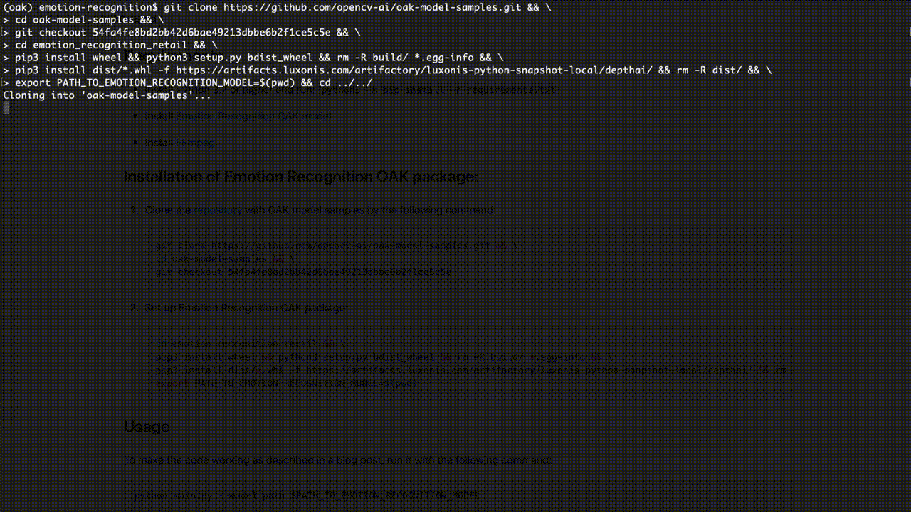

This contains the code for **Using OpenCV AI Kit with Modelplace.ai To Create Real-time Reaction Videos**. For more information - visit [OpenCV.AI](https://opencv.ai/post/emotion-recognition).

# OAK Emotion Recognition



## Requirements

- Install Python 3.7 or higher and run: `python3 -m pip install -r requirements.txt`

- Install [Emotion Recognition OAK model](https://github.com/opencv-ai/opencv-blog/tree/main/OAK-Marketplace-Emotion-Recognition#installation-of-emotion-recognition-oak-package)

- Install [FFmpeg](https://ffmpeg.org/download.html)

## Installation of Emotion Recognition OAK package:

1. Clone the [repository](https://github.com/opencv-ai/oak-model-samples) with OAK model samples by the following command:

    ```bash
    git clone https://github.com/opencv-ai/oak-model-samples.git && \
    cd oak-model-samples && \
    git checkout 54fa4fe8bd2bb42d6bae49213dbbe6b2f1ce5c5e
    ```

2. Set up Emotion Recognition OAK package:

    ```bash
    cd emotion_recognition_retail && \
    pip3 install wheel && python3 setup.py bdist_wheel && rm -R build/ *.egg-info && \
    pip3 install dist/*.whl -f https://artifacts.luxonis.com/artifactory/luxonis-python-snapshot-local/depthai/ && rm -R dist/ && \
    export PATH_TO_EMOTION_RECOGNITION_MODEL=$(pwd)
    ```

## Usage

To make the code working as described in a blog post, run it with the following command:

```bash
python main.py --model-path $PATH_TO_EMOTION_RECOGNITION_MODEL
```

```
usage: main.py [-h] [--model-path MODEL_PATH] [--visualize {0,1}]
               [--save-video {0,1}] [--save-statistics {0,1}]
               [--visualization-size VISUALIZATION_SIZE]

optional arguments:
  -h, --help            show this help message and exit
  --model-path MODEL_PATH
                        Path to Emotion Recognition model
  --visualize {0,1}      If set to 1, visualize the results
  --save-video {0,1}    If set to 1, save the visualization results onto a MP4
                        video file
  --save-statistics {0,1}
                        If set to 1, save the statistics onto a PNG image file
  --visualization-size Saved video visualization size (pixels)
```

## Troubleshooting

<details>
  <summary>RuntimeError: Failed to find device after booting, error message: X_LINK_DEVICE_NOT_FOUND</summary>
  
  <p>
  
  If while running the app, you get an error:
  
  `Failed to find device after booting, error message: X_LINK_DEVICE_NOT_FOUND`  
  
  Please, run the following command:

```bash
echo 'SUBSYSTEM=="usb", ATTRS{idVendor}=="03e7", MODE="0666"' | \ 
sudo tee /etc/udev/rules.d/80-movidius.rules && \
sudo udevadm control --reload-rules
```
  
</details>
